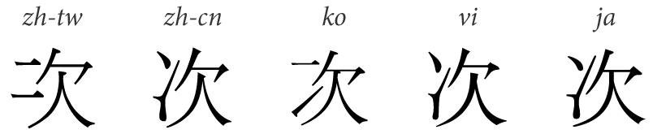

# 한자

한자는 크게 2가지 분류로 나뉜다.

- 전통식
- 간략식

그러나 국가에 따라서 분류는 더 세부적으로 나뉜다.

- 전통식
	- 한국식 한자
	- 중국식 한자
		- 대만 한자
		- 홍콩/마카오 한자
- 간략식
	- 중국식 간화체
	- 일본식 신자체

먼저 유니코드에 있는 '한중일통합한자(CJK Unified Ideograph)'라는 개념을 알아둘 필요가 있다.

한자라고 해서 모양이 항상 고정인 것이 아니다.

같은 유니코드 값을 쓰는 한자라고 하더라도,
언어 설정에 따라, 그리고 폰트에 따라 또 다르게 보일 수가 있다.

위는 
